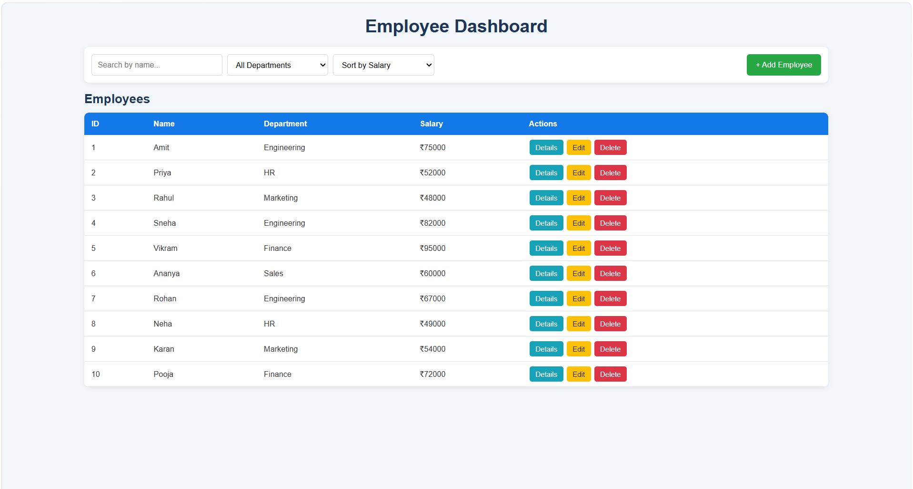

# Day 5: JavaScript & Employee Dashboard

## 1. Project Overview

This project focuses on learning modern JavaScript concepts, asynchronous programming, JSON handling, and Fetch API through practical exercises and an Employee Dashboard.

## 2. Problem Statement

The aim is to develop a simple web-based application for displaying and managing employee records with search, filtering, sorting, and basic CRUD operations.

## 3. Features

- JavaScript fundamentals and ES6+ concepts
- Arrays, objects, functions, and array methods
- Scope, closures, callbacks, Promises, and async/await
- Event loop, modules, and error handling
- Employee listing and search
- Department filtering
- Salary sorting
- Employee details
- Add, edit, and delete employees
- JSON data loading using Fetch API

## 4. Technology Stack

- HTML5
- CSS3
- JavaScript (ES6+)
- JSON
- Fetch API
- VS Code
- Live Server

## 5. Architecture

```text
HTML + CSS
    ↓
JavaScript
    ↓
Fetch API
    ↓
employees.json
    ↓
Employee Dashboard
```

## 6. Project Structure

```text
day_05/
├── javascript/
├── employee-dashboard/
│   ├── index.html
│   ├── style.css
│   ├── script.js
│   └── employees.json
├── dashboard.png
└── README.md
```

## 7. Installation & How to Run

1. Open the `day_05` folder in VS Code.
2. Open the `employee-dashboard` folder.
3. Open `index.html`.
4. Run the project using **Live Server**.
5. The Employee Dashboard will open in the browser.

## 8. Screenshot

### Employee Dashboard



## 9. Challenges & Solutions

**Challenge:** Handling employee data, asynchronous JSON loading, and dynamic dashboard updates.

**Solution:** Used Fetch API, `async/await`, reusable functions, DOM manipulation, and JavaScript array methods such as `map()`, `filter()`, `find()`, and `sort()`.

## 10. Future Scope

- Connect the dashboard to a backend REST API.
- Add database storage for permanent data.
- Implement authentication and user roles.
- Add charts and analytics for employee information.