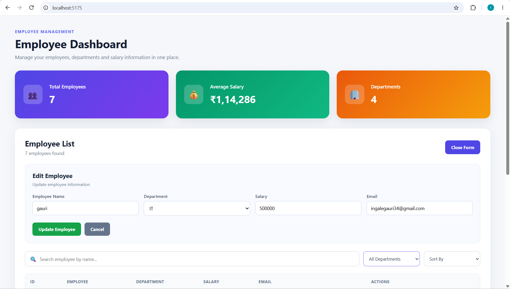
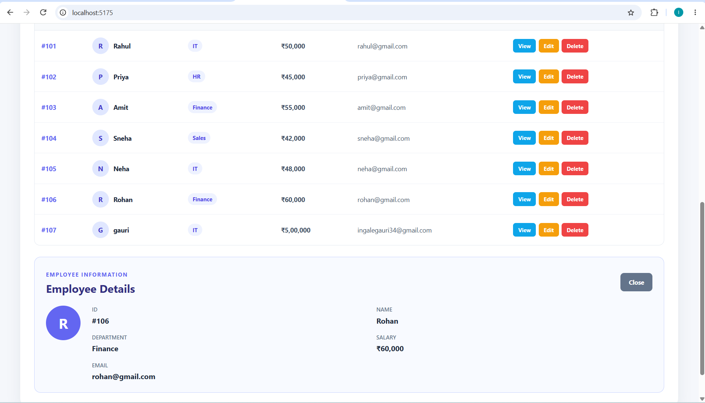

# Day 6: TypeScript + React Employee Management Dashboard

## Project Overview

This project is part of the 10-Day Intern Technical Training & Domain Assessment Program. It focuses on TypeScript and React development by building a strongly typed Employee Management System and a modern, component-based Employee Management Dashboard.

The project extends employee management concepts with TypeScript type safety, React components, Hooks, CRUD operations, REST API integration, and a responsive dashboard.

## Problem Statement

Managing employee records manually can make searching, updating, filtering, and maintaining employee information difficult. JavaScript applications can also become harder to maintain as the project grows without proper type safety and component structure.

This project addresses these challenges by using TypeScript for type-safe development and React for a reusable, component-based Employee Management Dashboard.

## Features

- **TypeScript Practice:** Covers interfaces, type aliases, union types, enums, optional properties, functions, classes, generics, type narrowing, and type guards.
- **Dashboard Metrics:** Displays Total Employees, Average Salary, and number of Departments.
- **CRUD Operations:** Add, Edit, View, and Delete employee records.
- **Search & Filtering:** Search employees by name and filter employees by department.
- **Sorting:** Sort employees by name and salary.
- **Form Validation:** Validates employee name, salary, and email before submission.
- **REST API Integration:** Uses JSON Server and Fetch API for employee data management.
- **Reusable Components:** Uses separate Dashboard, EmployeeList, and EmployeeForm components.
- **Custom Hook:** Uses a custom Hook to manage employee data and API operations.
- **Loading & Error Handling:** Provides loading states and API error messages.

## Technology Stack

- **Frontend:** React
- **Language:** TypeScript
- **Build Tool:** Vite
- **Styling:** CSS
- **API:** JSON Server
- **API Communication:** Fetch API
- **State Management:** React Hooks
- **Development Tools:** VS Code, npm
- **Version Control:** Git and GitHub

## Architecture & Project Structure

The project follows a component-based React architecture with separate files for UI components, employee data handling, and API operations.

```text
day_06/
├── typescript/
│   ├── typescript_practice.ts
│   └── employee_management.ts
│
├── react-app/
│   ├── src/
│   │   ├── components/
│   │   │   ├── Dashboard.tsx
│   │   │   ├── EmployeeList.tsx
│   │   │   └── EmployeeForm.tsx
│   │   ├── hooks/
│   │   │   └── useEmployees.ts
│   │   ├── App.tsx
│   │   ├── App.css
│   │   ├── index.css
│   │   └── main.tsx
│   ├── db.json
│   └── package.json
│
├── screenshot/
└── README.md
```

### Architecture

- **Components:** Reusable UI components for dashboard, employee list, and forms.
- **Custom Hook:** Handles employee data and API operations.
- **React State:** Manages search, filtering, sorting, forms, and employee details.
- **JSON Server:** Provides the local REST API.
- **TypeScript:** Provides type safety using interfaces and typed functions.

## Installation

### 1. Clone the Repository

```bash
git clone https://github.com/GauriIngale20/Internship-Training_Tasks.git
```

### 2. Navigate to the React Project

```bash
cd Internship-Training_Tasks/day_06/react-app
```

### 3. Install Dependencies

```bash
npm install
```

### 4. Install JSON Server

```bash
npm install json-server@0.17.4
```

## Environment Variables

No environment variables are required for this project.

The application uses the following local API:

```text
http://localhost:3001/employees
```

## How to Run

### Start JSON Server

```bash
npx json-server db.json --port 3001
```

### Start React Application

Open another terminal and run:

```bash
npm run dev
```

The application will be available on the Vite development server.

## Database & API

Employee data is stored in `db.json` and managed using JSON Server.

### API Endpoints

```text
GET    /employees
POST   /employees
PUT    /employees/:id
DELETE /employees/:id
```

The `useEmployees.ts` custom hook handles API requests and employee data management.

## Screenshots

### Employee Management Dashboard






## Challenges Faced

- Understanding TypeScript interfaces and types
- Managing React component state
- Connecting React with JSON Server
- Implementing CRUD operations
- Handling search, filtering, and sorting
- Managing API loading and error states
- Creating reusable React components

## Solutions

- Used TypeScript interfaces for employee data.
- Created reusable React components.
- Used a custom hook for API operations.
- Used `useState` for state management.
- Used `useEffect` for fetching employee data.
- Added form validation.
- Added loading and error handling.

## Future Improvements

- User authentication
- Backend database integration
- Pagination
- Advanced filtering
- Employee profile pages
- Role-based access control
- Cloud deployment
- Advanced analytics and charts

## Learning Outcomes

Through this project, I learned:

- TypeScript fundamentals
- Interfaces and type aliases
- Union types and enums
- Functions and classes
- Generics and type guards
- React components and props
- State and event handling
- Forms and validation
- React Hooks
- Custom Hooks
- API integration
- CRUD operations
- Component-based architecture
- Git and GitHub

## Conclusion

The Day 6 project provided practical experience in building a structured and interactive web application using TypeScript and React.

The Employee Management Dashboard demonstrates CRUD operations, reusable components, API integration, state management, form validation, and TypeScript type safety.
