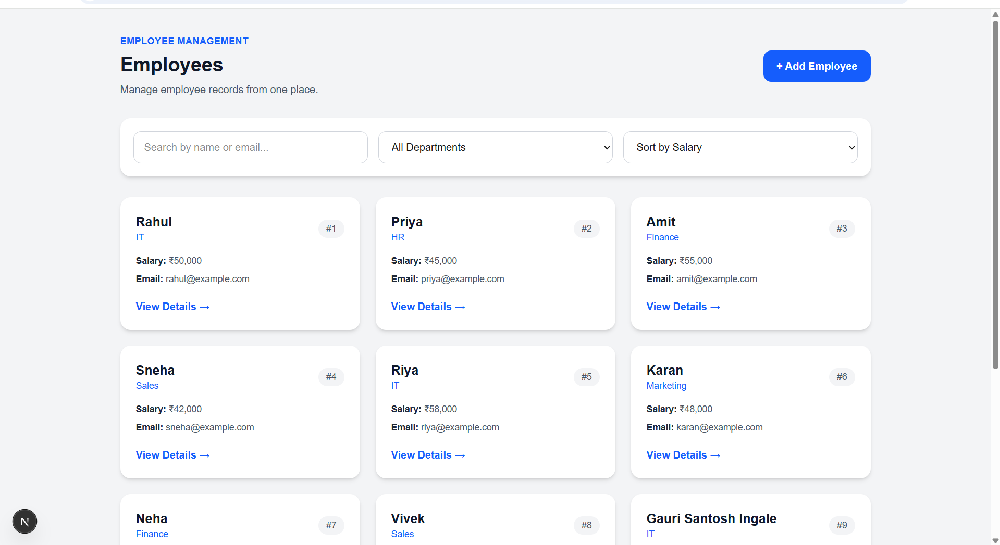
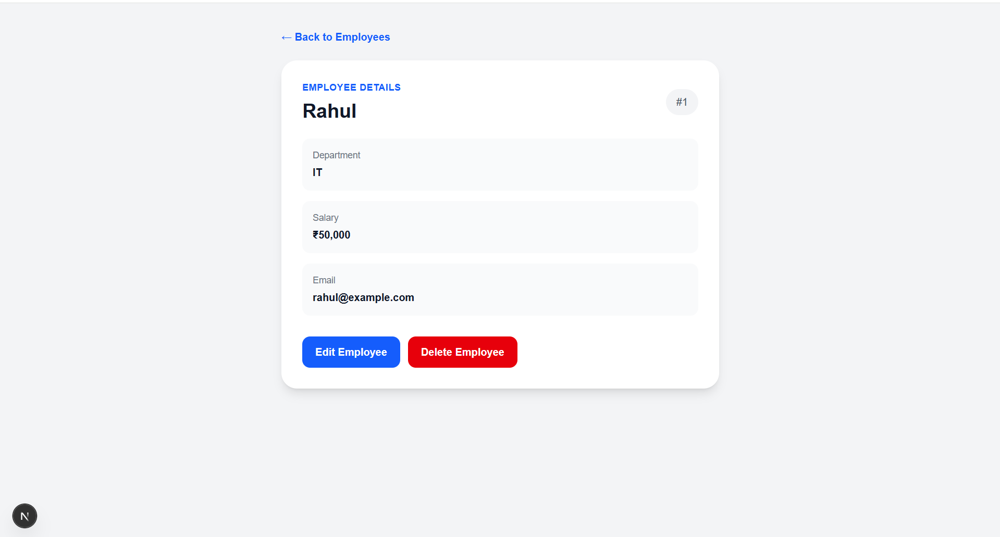
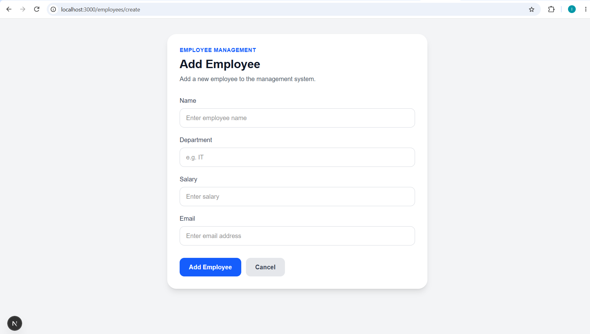
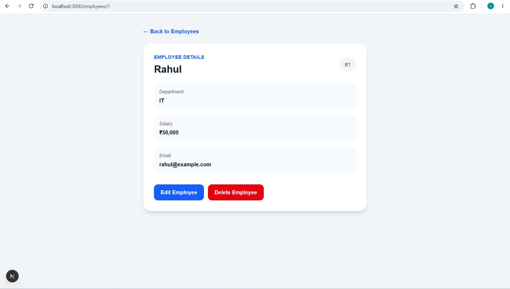

# Day 7 — Next.js + Node.js Employee Management System

## Overview

A full-stack Employee Management System developed using Next.js, TypeScript, Tailwind CSS, Node.js, and Express.js.

The application provides a modern employee dashboard with search, filtering, sorting, employee details, and complete CRUD operations through a REST API.

## Technologies Used

### Frontend

* Next.js
* TypeScript
* React
* Tailwind CSS

### Backend

* Node.js
* Express.js
* REST API
* JSON-based data storage

## Features

* Employee dashboard
* Search employees by name or email
* Filter employees by department
* Sort employees by salary
* View employee details
* Add new employees
* Edit employee information
* Delete employees
* Dynamic employee routes
* Form validation
* API validation
* Error handling
* Loading state
* Responsive user interface

## Project Structure

```text
day_07/
├── nextjs-app/
│   ├── app/
│   │   ├── employees/
│   │   │   ├── [id]/
│   │   │   │   ├── edit/
│   │   │   │   └── page.tsx
│   │   │   ├── create/
│   │   │   ├── page.tsx
│   │   │   ├── loading.tsx
│   │   │   └── error.tsx
│   │   ├── layout.tsx
│   │   ├── page.tsx
│   │   └── globals.css
│   ├── components/
│   ├── lib/
│   └── types/
│
├── node-api/
│   ├── src/
│   │   ├── controllers/
│   │   ├── middleware/
│   │   ├── models/
│   │   ├── routes/
│   │   ├── services/
│   │   └── utils/
│   ├── data/
│   └── package.json
│
├── screenshots/
│   ├── dashboard.png
│   ├── employee-details.png
│   ├── add-employee.png
│   └── edit-employee.png
│
└── README.md
```

## Next.js Application Routes

| Route                  | Description        |
| ---------------------- | ------------------ |
| `/`                    | Home page          |
| `/employees`           | Employee dashboard |
| `/employees/[id]`      | Employee details   |
| `/employees/[id]/edit` | Edit employee      |
| `/employees/create`    | Add employee       |

## REST API Endpoints

| Method | Endpoint             | Description        |
| ------ | -------------------- | ------------------ |
| GET    | `/api/employees`     | Get all employees  |
| GET    | `/api/employees/:id` | Get employee by ID |
| POST   | `/api/employees`     | Create employee    |
| PUT    | `/api/employees/:id` | Update employee    |
| DELETE | `/api/employees/:id` | Delete employee    |

## Backend Architecture

The Node.js backend follows a structured architecture:

* **Routes** — Define API endpoints
* **Controllers** — Handle requests and responses
* **Services** — Contain business logic
* **Models** — Manage employee data
* **Middleware** — Handle validation and errors
* **Utils** — Provide reusable response functions

## Screenshots

### Employee Dashboard

[](screenshots/dashboard.png)

### Employee Details

[](screenshots/employee-details.png)

### Add Employee

[](screenshots/add-employee.png)

### Edit Employee

[](screenshots/edit-employee.png)

## Project Highlights

This project demonstrates modern full-stack development using the Next.js App Router for the frontend and a structured Express.js REST API for backend operations.

The application integrates frontend and backend services to provide complete employee management functionality with a clean and responsive user interface.
